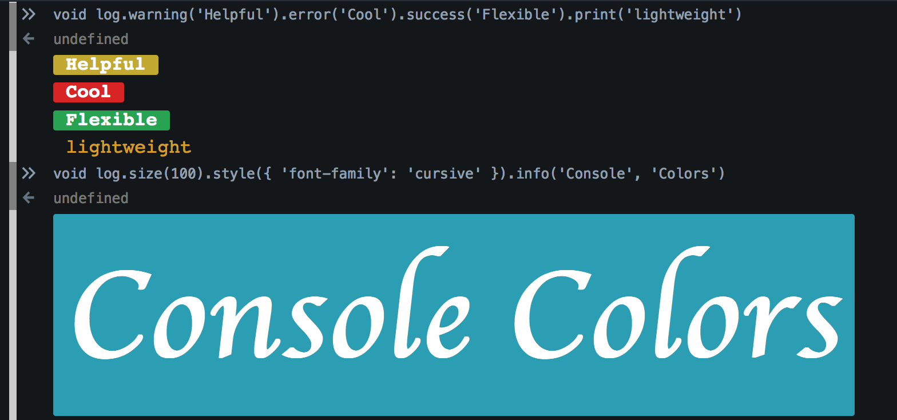

Console-Color
---------------
Make your `console.log`s look **fabulous**

## what is it
Console log statements are boring, with styles that put people to sleep. That all changed with Firefox and Chrome's new [colored output](http://stackoverflow.com/questions/7505623/colors-in-javascript-console#answer-13017382)... except it didn't. People are still using the same ugly console.logs as before. This library aims to show people how it's done, all while making it dead simple to log beautiful messages.



## using it
Simply include it as a script tag in your project:
```html
<script src="colors.js"></script>
```
> &ast;side effects may include awesomeness

The script will export the `log` global.

### log.print(...msgs)
The most basic log is `log.print()`. It takes arguments and prints them to the console, applying very basic styling.

> **note:** every time `.print` is called, the style is reset to it's initial state.

### log.color(color)
Set the text color. This is a css setting, and can take anything css can.

```javascript
log.color('red').print('Rogue llama!')
```

### log.bkg(color)
Set the background color of the message.

```javascript
log.bkg('#303438').print('hello')
```

### log.size(px)
Change the font size of the log message. It defaults to 'px' when
numbers are given, but can accept any format, such as '125%', '0.8em', etc.

```javascript
log.size(150).print('huge message!')
```

### log.style(Object)
Fine-tune the style of your messages by passing an object
containing css properties into this method.

```javascript
log.style({
	'font-family': 'monaco',
	'border-radius': '10px',
	padding: '15px'
})
log.print('Stylish output')
```

> **note:** not all css properties work in the console :(

### log.big.print()
A shorthand for bold font. It's the same as writing:
```javascript
log.style({ 'font-weight': 'bold' }).print('bolded text')
```

## Pre-styled output methods
We love ya. That's why we included stylish presets to
make beautiful `console.log`s.

- success
- error
- warning
- info

```javascript
log.success('Yey! Success!')
log.error('naaaayyy')
log.warning('mind the velociraptors')
log.info('waffles 50% off on aisle 13')
```

## chainable goodness
Nobody likes repeating themselves with code. That's why each method can be chained after the previous, all nifty-like.

```javascript
log.color('lightgreen').size(50).style({
	'font-style': 'italic'
}).print('wazzzaaap')
```

## drawbacks
Not all browsers are awesome. Only Firefox and Chrome support colorful logs.

String coercion in log statements: if you wanna log an object, it'll be forced into a string, ending up like "[object Object]" and that never helped anyone :(
<br> in those cases, just use `console.log` itself.

> **legal footnote:** Does not ship with bacon.